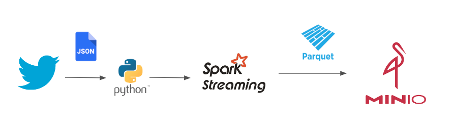
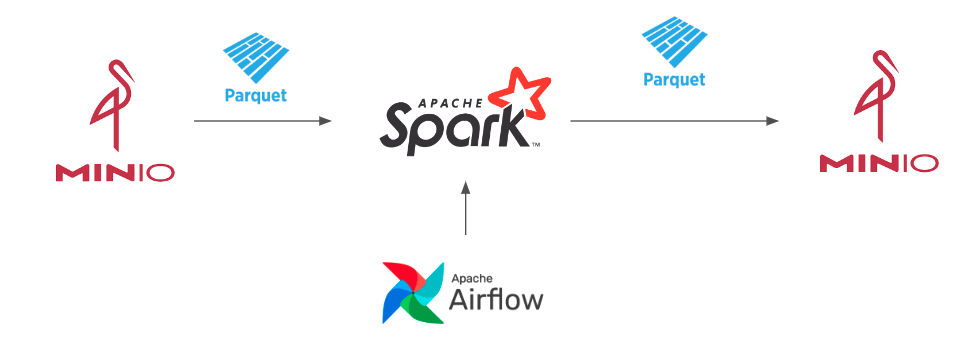

# Twitter - Data Project 

**Implemente uma solução que:**

- Consiga buscar tweets com uma determinada “HashTag”, por exemplo, covid19.
- Armazenar os resultados em formato Parquet
- Criar um datalake para que seja possível consolidar dados analíticos por hashtag e posteriormente consultar informações coletadas de forma batch / online.

**Recomendamos a utilização das seguintes tecnologias:**

- Spark – Para extração, escrita e consolidação
- Airflow – Orquestração do processamento
- Docker / Compose – Para deploy da aplicação

**Testes/Tópicos que consideramos importantes:**

- Organização
- Testes automatizados
- Boas práticas de Data Engineering
- Arquitetura
- Solução para Deploy em produção
- Criatividade

Neste projeto foi utilizado as seguintes tecnologias open source:
- [Docker](https://www.docker.com)
- [Airflow](https://airflow.apache.org) 
- [Min.io](https://min.io) 
- [Spark](https://spark.apache.org) 
- [Metabase](https://www.metabase.com)

## Arquitetura

### ingestão Streaming


### Transformação em batch


 

## Instalação
O projeto contém um arquivo Make para facilitar a operação.
```
cd devops
```

### Instalando dependências
```
make install_dependencies 
``` 
 
### Iniciando serviço de storage
```
make start_storage
``` 

### Iniciando serviços de ingestão
O serviço de ingestão recebe na variável `TWITTER_PARAM` o filtro que será enviado na requisição do Twiiter.
```
TWITTER_PARAM=covid19,omicron make start_ingestion 
``` 
 
### Iniciando serviços batch
```
make start 
``` 

### Parando serviços
```
make stop 
```
### Verificando status dos serviços
```
make status 
```

 